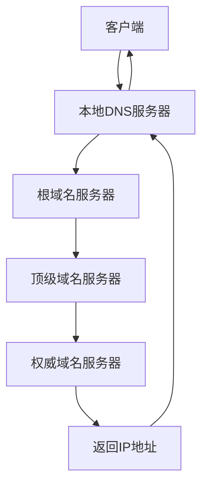

## 引言

在网络通信日益复杂的今天，理解各种网络协议的工作原理和应用场景对于开发者和系统管理员来说至关重要。从基础的HTTP请求到复杂的HTTPS加密通信，从域名解析到SSL证书的申请和部署，每一个环节都影响着网络应用的性能和安全性。本文将深入探讨网络协议请求的全过程，包括隧道技术、HTTP/HTTPS协议、域名系统以及SSL证书的完整使用流程。

## 网络协议基础概念

### OSI七层模型

理解网络协议首先要了解OSI（Open Systems Interconnection）七层模型，它是网络通信的标准框架：

1. **物理层（Physical Layer）**：负责比特流的传输
2. **数据链路层（Data Link Layer）**：负责节点间的数据传输
3. **网络层（Network Layer）**：负责数据包的路由和转发
4. **传输层（Transport Layer）**：负责端到端的数据传输
5. **会话层（Session Layer）**：负责建立、管理和终止会话
6. **表示层（Presentation Layer）**：负责数据的格式化和加密
7. **应用层（Application Layer）**：为应用程序提供网络服务

### TCP/IP四层模型

在实际应用中，TCP/IP四层模型更为常用：

1. **网络接口层**：对应OSI的物理层和数据链路层
2. **网络层**：对应OSI的网络层
3. **传输层**：对应OSI的传输层
4. **应用层**：对应OSI的会话层、表示层和应用层

## 隧道技术详解

隧道技术是一种在网络之间传递数据的方式，它允许一个网络协议封装在另一个网络协议中进行传输。

### 隧道的基本原理

隧道技术通过将一种协议的数据包封装在另一种协议的数据包中来实现跨网络传输。发送方将原始数据包封装在隧道协议的数据包中，通过隧道传输到接收方，接收方再解封装得到原始数据包。

### 常见的隧道协议

#### 1. GRE（Generic Routing Encapsulation）

GRE是一种通用的隧道协议，可以封装多种协议的数据包。

```bash
# Linux配置GRE隧道示例
# 在服务器A上配置
ip tunnel add gre1 mode gre remote 192.168.1.2 local 192.168.1.1
ip addr add 10.0.0.1/30 dev gre1
ip link set gre1 up

# 在服务器B上配置
ip tunnel add gre1 mode gre remote 192.168.1.1 local 192.168.1.2
ip addr add 10.0.0.2/30 dev gre1
ip link set gre1 up
```

#### 2. IPSec隧道

IPSec提供安全的隧道传输，常用于VPN。

```bash
# IPSec配置示例（strongSwan）
# /etc/ipsec.conf
conn myvpn
    left=192.168.1.1
    leftsubnet=10.0.0.0/24
    right=192.168.1.2
    rightsubnet=10.0.1.0/24
    ike=aes256-sha256-modp2048!
    esp=aes256-sha256!
    keyingtries=0
    ikelifetime=1h
    lifetime=8h
    dpddelay=30
    dpdtimeout=120
    dpdaction=clear
```

#### 3. SSH隧道

SSH隧道是一种简单易用的隧道技术，可用于端口转发。

```bash
# 本地端口转发
ssh -L 8080:localhost:80 user@remote-server

# 远程端口转发
ssh -R 8080:localhost:80 user@remote-server

# 动态端口转发（SOCKS代理）
ssh -D 1080 user@remote-server
```

### 隧道技术的应用场景

1. **VPN连接**：通过公共网络安全访问私有网络
2. **绕过防火墙**：访问被限制的网络资源
3. **IPv6过渡**：在IPv4网络上传输IPv6数据包
4. **负载均衡**：在多个服务器间分配流量

## HTTP协议详解

HTTP（HyperText Transfer Protocol）是万维网数据通信的基础协议。

### HTTP/1.1协议特点

HTTP/1.1是目前广泛使用的HTTP版本，具有以下特点：

1. **持久连接**：默认使用持久连接，减少连接建立开销
2. **管道化**：允许客户端发送多个请求而不等待响应
3. **分块传输编码**：支持动态内容的流式传输
4. **字节范围请求**：支持断点续传

### HTTP请求方法

```http
GET /index.html HTTP/1.1
Host: www.example.com
User-Agent: Mozilla/5.0
Accept: text/html,application/xhtml+xml
Connection: keep-alive

POST /api/login HTTP/1.1
Host: www.example.com
Content-Type: application/json
Content-Length: 52

{
    "username": "user",
    "password": "pass"
}
```

### HTTP状态码

```
1xx: 信息性状态码
2xx: 成功状态码（200 OK, 201 Created, 204 No Content）
3xx: 重定向状态码（301 Moved Permanently, 302 Found, 304 Not Modified）
4xx: 客户端错误状态码（400 Bad Request, 401 Unauthorized, 404 Not Found）
5xx: 服务器错误状态码（500 Internal Server Error, 502 Bad Gateway, 503 Service Unavailable）
```

### HTTP头部字段

```http
# 请求头
Host: www.example.com
User-Agent: Mozilla/5.0 (Windows NT 10.0; Win64; x64)
Accept: text/html,application/xhtml+xml,application/xml;q=0.9,*/*;q=0.8
Accept-Language: en-US,en;q=0.5
Accept-Encoding: gzip, deflate
Connection: keep-alive
Upgrade-Insecure-Requests: 1

# 响应头
HTTP/1.1 200 OK
Date: Mon, 29 Nov 2025 10:30:00 GMT
Server: Apache/2.4.41 (Ubuntu)
Content-Type: text/html; charset=UTF-8
Content-Length: 1234
Last-Modified: Sun, 28 Nov 2025 15:00:00 GMT
ETag: "123456789"
Cache-Control: max-age=3600
```

## HTTPS协议与SSL/TLS

HTTPS（HTTP Secure）是HTTP的安全版本，通过SSL/TLS协议提供加密传输。

### SSL/TLS协议层次

SSL/TLS协议位于传输层和应用层之间，为应用层提供安全服务：

1. **握手协议**：协商加密算法和交换密钥
2. **记录协议**：封装应用数据并提供加密和完整性保护
3. **警告协议**：传递警告和错误信息
4. **变更密码规格协议**：通知对方后续消息将使用新协商的密钥

### TLS握手过程

```
1. Client Hello：客户端发送支持的TLS版本、加密套件列表等
2. Server Hello：服务器选择TLS版本和加密套件
3. Certificate：服务器发送证书
4. Server Key Exchange：服务器发送密钥交换参数（如需要）
5. Server Hello Done：服务器完成握手消息
6. Client Key Exchange：客户端发送密钥交换参数
7. Change Cipher Spec：双方通知后续消息将加密
8. Finished：双方验证握手过程的完整性
```

### 加密套件

常见的TLS加密套件包括：

```
TLS_ECDHE_RSA_WITH_AES_128_GCM_SHA256
TLS_ECDHE_RSA_WITH_AES_256_GCM_SHA384
TLS_ECDHE_ECDSA_WITH_AES_128_GCM_SHA256
TLS_ECDHE_ECDSA_WITH_AES_256_GCM_SHA384
```

## 域名系统（DNS）详解

DNS（Domain Name System）是互联网的电话簿，负责将域名转换为IP地址。

### DNS解析过程



### DNS记录类型

1. **A记录**：将域名映射到IPv4地址
2. **AAAA记录**：将域名映射到IPv6地址
3. **CNAME记录**：别名记录，指向另一个域名
4. **MX记录**：邮件交换记录，指定邮件服务器
5. **TXT记录**：文本记录，用于SPF、DKIM等
6. **NS记录**：名称服务器记录，指定域名服务器

### DNS查询命令

```bash
# 查询A记录
dig example.com A

# 查询MX记录
dig example.com MX

# 反向查询
dig -x 8.8.8.8

# 使用指定DNS服务器查询
dig @8.8.8.8 example.com

# 查询完整的DNS解析过程
dig +trace example.com
```

## SSL证书全流程详解

SSL证书是实现HTTPS加密的关键组件，它的申请、部署和管理是一个完整的过程。

### SSL证书类型

#### 1. 域名验证型（DV）

- 验证方式：通过域名所有权验证
- 颁发速度：几分钟到几小时
- 适用场景：个人网站、博客等

#### 2. 组织验证型（OV）

- 验证方式：验证组织身份
- 颁发速度：1-3个工作日
- 适用场景：企业网站

#### 3. 扩展验证型（EV）

- 验证方式：严格的身份验证
- 颁发速度：1-2周
- 适用场景：银行、电商等对安全性要求极高的网站

### SSL证书申请流程

#### 步骤1：生成私钥和CSR

```bash
# 生成私钥
openssl genrsa -out example.com.key 2048

# 生成CSR（证书签名请求）
openssl req -new -key example.com.key -out example.com.csr

# 查看CSR内容
openssl req -in example.com.csr -noout -text
```

CSR生成时需要填写以下信息：
- Country Name (2 letter code)：国家代码（如CN）
- State or Province Name：省份
- Locality Name：城市
- Organization Name：组织名称
- Organizational Unit Name：部门名称
- Common Name：域名（如example.com）
- Email Address：邮箱地址

#### 步骤2：选择证书颁发机构（CA）

常见的CA包括：
- Let's Encrypt（免费）
- DigiCert
- GlobalSign
- Comodo
- Symantec

#### 步骤3：提交CSR并完成验证

##### 域名验证方式：

1. **DNS验证**：在DNS记录中添加特定的TXT记录
2. **文件验证**：在网站根目录放置验证文件
3. **邮箱验证**：向管理员邮箱发送验证邮件

##### 示例：Let's Encrypt申请证书

```bash
# 安装Certbot
sudo apt install certbot

# 使用DNS验证申请证书
sudo certbot certonly --manual --preferred-challenges dns -d example.com -d www.example.com

# 使用Web服务器验证申请证书
sudo certbot --nginx -d example.com -d www.example.com
```

#### 步骤4：下载和安装证书

```bash
# Let's Encrypt证书路径
/etc/letsencrypt/live/example.com/fullchain.pem  # 证书链
/etc/letsencrypt/live/example.com/privkey.pem    # 私钥
```

#### 步骤5：配置Web服务器

##### Nginx配置示例：

```nginx
server {
    listen 443 ssl http2;
    server_name example.com www.example.com;
    
    ssl_certificate /etc/letsencrypt/live/example.com/fullchain.pem;
    ssl_certificate_key /etc/letsencrypt/live/example.com/privkey.pem;
    
    # SSL安全配置
    ssl_protocols TLSv1.2 TLSv1.3;
    ssl_ciphers ECDHE-RSA-AES128-GCM-SHA256:ECDHE-RSA-AES256-GCM-SHA384;
    ssl_prefer_server_ciphers off;
    
    # OCSP Stapling
    ssl_stapling on;
    ssl_stapling_verify on;
    resolver 8.8.8.8 8.8.4.4 valid=300s;
    
    # HSTS
    add_header Strict-Transport-Security "max-age=63072000" always;
    
    root /var/www/example.com;
    index index.html;
    
    location / {
        try_files $uri $uri/ =404;
    }
}

# HTTP重定向到HTTPS
server {
    listen 80;
    server_name example.com www.example.com;
    return 301 https://$server_name$request_uri;
}
```

##### Apache配置示例：

```apache
<VirtualHost *:443>
    ServerName example.com
    DocumentRoot /var/www/example.com
    
    SSLEngine on
    SSLCertificateFile /etc/letsencrypt/live/example.com/fullchain.pem
    SSLCertificateKeyFile /etc/letsencrypt/live/example.com/privkey.pem
    
    # SSL安全配置
    SSLProtocol all -SSLv3 -TLSv1 -TLSv1.1
    SSLCipherSuite ECDHE-RSA-AES128-GCM-SHA256:ECDHE-RSA-AES256-GCM-SHA384
    SSLHonorCipherOrder off
    
    # HSTS
    Header always set Strict-Transport-Security "max-age=63072000"
</VirtualHost>

# HTTP重定向到HTTPS
<VirtualHost *:80>
    ServerName example.com
    Redirect permanent / https://example.com/
</VirtualHost>
```

### SSL证书管理

#### 证书续期

```bash
# 手动续期
sudo certbot renew

# 自动续期（cron任务）
# 添加到crontab
0 12 * * * /usr/bin/certbot renew --quiet

# 测试续期过程
sudo certbot renew --dry-run
```

#### 证书监控

```bash
# 检查证书过期时间
echo | openssl s_client -connect example.com:443 2>/dev/null | openssl x509 -noout -dates

# 使用脚本监控证书过期
#!/bin/bash
DOMAIN="example.com"
EXPIRY_DATE=$(echo | openssl s_client -connect $DOMAIN:443 2>/dev/null | openssl x509 -noout -enddate | cut -d= -f2)
EXPIRY_SECONDS=$(date -d "$EXPIRY_DATE" +%s)
CURRENT_SECONDS=$(date +%s)
DAYS_LEFT=$(( ($EXPIRY_SECONDS - $CURRENT_SECONDS) / 86400 ))

if [ $DAYS_LEFT -lt 30 ]; then
    echo "SSL certificate for $DOMAIN expires in $DAYS_LEFT days"
    # 发送告警通知
fi
```

#### 证书撤销

```bash
# 撤销Let's Encrypt证书
sudo certbot revoke --cert-path /etc/letsencrypt/live/example.com/cert.pem
```

## 网络请求性能优化

### 连接优化

1. **HTTP/2**：支持多路复用，减少连接数
2. **连接池**：复用连接，减少握手开销
3. **持久连接**：避免频繁建立和关闭连接

### 缓存策略

```http
# 浏览器缓存
Cache-Control: max-age=3600
Expires: Wed, 21 Oct 2025 07:28:00 GMT

# 条件请求
ETag: "123456789"
Last-Modified: Sun, 28 Nov 2025 15:00:00 GMT
```

### 内容压缩

```nginx
# Nginx Gzip配置
gzip on;
gzip_vary on;
gzip_min_length 1024;
gzip_comp_level 6;
gzip_types
    text/plain
    text/css
    text/xml
    text/javascript
    application/json
    application/javascript
    application/xml+rss;
```

## 安全最佳实践

### HTTPS配置安全

```nginx
# 强制HTTPS
add_header Strict-Transport-Security "max-age=63072000" always;

# 防止点击劫持
add_header X-Frame-Options DENY always;

# 防止MIME类型嗅探
add_header X-Content-Type-Options nosniff always;

# XSS防护
add_header X-XSS-Protection "1; mode=block" always;
```

### 证书安全

1. **私钥保护**：设置适当权限，避免泄露
2. **定期更新**：及时更新证书，避免过期
3. **OCSP Stapling**：提高证书验证效率
4. **证书透明度**：监控证书颁发情况

## 故障排查工具

### 网络诊断工具

```bash
# ping测试连通性
ping example.com

# traceroute跟踪路由
traceroute example.com

# telnet测试端口连通性
telnet example.com 80

# curl测试HTTP请求
curl -v https://example.com

# nslookup查询DNS
nslookup example.com
```

### SSL证书测试

```bash
# 测试SSL连接
openssl s_client -connect example.com:443

# 测试SSL证书详细信息
echo | openssl s_client -connect example.com:443 2>/dev/null | openssl x509 -noout -text

# 使用在线工具测试SSL配置
# https://www.ssllabs.com/ssltest/
```

## 结语

网络协议请求涉及从底层的隧道技术到应用层的HTTP/HTTPS协议，再到域名解析和SSL证书管理等多个方面。理解这些技术的原理和实现方式，对于构建安全、高效的网络应用至关重要。

随着技术的不断发展，新的协议和标准不断涌现，如HTTP/3、QUIC等，为我们提供了更好的性能和安全性。在实际应用中，我们需要根据具体需求选择合适的技术方案，并持续关注新技术的发展趋势，不断优化和完善我们的网络架构。

通过本文的介绍，希望读者能够建立起对网络协议请求全流程的完整认识，并能够在实际工作中灵活运用这些知识解决遇到的问题。